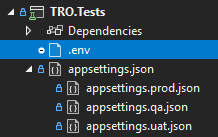

[](https://wtwdst.visualstudio.com/TRO_Git/_build/latest?definitionId=31&branchName=master)

<h1>Introduction</h1>

End to end tests of the _Total Rewards Optimization_ app.

[[_TOC_]]

# Pre-requisite
See [get started](https://wtwdst.visualstudio.com/QA/_wiki/wikis/docs/1467/Get-started)

# Clone
```
git clone https://wtwdst.visualstudio.com/eesqa/_git/e2e-tro
```

# Secrets
These test projects uses sensitive data such as user credentials for authentication.

## Local
> ⚠ Never store passwords or other sensitive data in source code.<br/>
[Safe storage of app secrets in development in ASP.NET Core](https://docs.microsoft.com/en-us/aspnet/core/security/app-secrets?view=aspnetcore-5.0&tabs=windows#secret-managehttps://docs.microsoft.com/en-us/aspnet/core/security/app-secrets?view=aspnetcore-5.0&tabs=windows#secret-manager)

1. Download [secrets.ps1](https://wtwdst.visualstudio.com/eesqa/_apis/git/repositories/e2e-tro/items?path=/.attachments/secrets.ps1&versionDescriptor%5BversionOptions%5D=0&versionDescriptor%5BversionType%5D=0&versionDescriptor%5Bversion%5D=status&resolveLfs=true&%24format=octetStream&api-version=5.0&download=true)
1. Right click the file and select **Run with PowerShell**
1. Click **Open** if prompted with _Do you want to open this file?_
1. Type **R** and hit **Enter** when prompted with _Do you want to run path/to/secrets.ps1?_

This script creates the secrets file and then opens it in notepad so that you can update the passwords.


_*** ask SDETs for the passwords_

## Production / CI
Secrets shouldn't be deployed with the app. Instead, production secrets should be accessed through a controlled means like environment variables or Azure Key Vault.

| Variable Group                                                                                                                                          | Description                                         |
|---------------------------------------------------------------------------------------------------------------------------------------------------------|-----------------------------------------------------|
| [tro-secrets](https://wtwdst.visualstudio.com/EESQA/_library?itemType=VariableGroups&view=VariableGroupView&variableGroupId=1103&path=tro-secrets)      | Total Rewards Optimization user secrets.            |
| [prod-tro-secrets](https://wtwdst.visualstudio.com/EESQA/_library?itemType=VariableGroups&view=VariableGroupView&variableGroupId=1103&path=tro-secrets) | Total Rewards Optimization production user secrets. |

# Configuration
These test projects uses the configuration builder built into the [.NET Generic Host](https://docs.microsoft.com/en-us/dotnet/core/extensions/generic-host)
specifically [JSON configuration provider](https://docs.microsoft.com/en-us/dotnet/core/extensions/configuration-providers#json-configuration-provider).

```csharp
// Startup.cs
public static IHostBuilder CreateHostBuilder(string[] args) =>
    Host.CreateDefaultBuilder(args)
        .ConfigureAppConfiguration((ctx, cfg) =>
        {
            // In case your wondering why not use the built-in ctx.HostingEnvironment
            // to get our environment, see "Caution when using appsettings.Production.json" below
            var env = Environment.GetEnvironmentVariable("ENVIRONMENT");
            cfg
                // Required default settings
                .AddJsonFile("appsettings.json", false)
                
                // Optional specific environment settings
                .AddJsonFile($"appsettings.{env}.json", true)

                // User secrets for local development
                .AddUserSecrets<Startup>()
                
                // For .env or CI overrides
                .AddEnvironmentVariables();
        });
```

> ⚠ Caution when using `appsettings.Production.json`
>
>Microsoft decided to make **Production** as a default value. See [Why is hosting environment default value "production"?](https://github.com/aspnet/Hosting/issues/863)<br/>
>
>TL;DR Even if they mean well, it does not fit well with our practices:
>- We use our local machines to run tests for in-sprint automation.
>- We use our local machines to re-run flaky tests in CI every weekend release (Go/No Go).
>- Test environment can be pointed to devs localhost for shift-left.
>
>Since .netcore will always find _appsettings.Production.json_ during startup, one can innocently run the tests against prod.<br/>
Let's just rename it to `appsettings.prod.json` then to avoid such incident.

## Options
[Options pattern in .NET](https://docs.microsoft.com/en-us/dotnet/core/extensions/options)
is implemented for these test projects.
| Project  | Class Name                                         |
|----------|----------------------------------------------------|
| Core.Dto | [PersonaOptions](src/Core.Dto/PersonaOptions.cs)   |
| Core.Dto | [TestDataOptions](src/Core.Dto/TestDataOptions.cs) |

## Overriding settings
During development you might want to try different settings while testing.<br/>
Usually you'll be doing that in _appsettings.json_ but doing so might lead to accidental check-in.<br/>

To avoid this, consider using environment variables instead.<br/>
> 🛈 Add a `.env` file in the root of the test project you're working if it doesn't exist yet.<br/>
Environment variable names reflect the structure of an _appsettings.json_ file.<br/>
The [naming of environment variables](https://docs.microsoft.com/en-gb/aspnet/core/fundamentals/configuration/?view=aspnetcore-5.0#naming-of-environment-variables)
section illustrates how you can represent the json structure.

Consider the ff appsettings files



### Scenario: _I want chrome to see the browser and auto open devtools._
Consider the ff _appsettings.json_ file
```json
{
  "webDriverOptions": {
    "chromeOptions": {
      "arguments": {
        "--headless": true
      }
    }
  }
}
```
In your `.env` file
```
webDriverOptions__chromeOptions__arguments__--headless=false
webDriverOptions__chromeOptions__arguments__--auto-open-devtools-for-tabs=true
```

### Scenario: _I want to test if the pages will load in 3 seconds_
Consider the ff _appsettings.json_ file
```json
{
  "webDriverOptions": {
    "asynchronousJavaScript": "00:00:15",
    "implicitWait": "00:00:15",
    "pageLoad": "00:00:15"
  }
}
```
In your `.env` file
```
webDriverOptions__asynchronousJavaScript=00:00:03
webDriverOptions__implicitWait=00:00:03
webDriverOptions__pageLoad=00:00:03
```

# Dependency Injection
These test projects uses [SpecFlow.DependencyInjection](https://github.com/solidtoken/SpecFlow.DependencyInjection) plugin that enables to use _Microsoft.Extensions.DependencyInjection_ for resolving test dependencies.

```csharp
// Startup.cs
[ScenarioDependencies]
public static IServiceCollection ConfigureServices() => new ServiceCollection()
    .AddScoped<ITestOutputHelper>(p =>
        p.GetRequiredService<ScenarioContext>().ScenarioContainer.Resolve<ITestOutputHelper>())
    ...
```

# Test Data

Design your scenarios to use a static data as much as possible to avoid long running tests and data cleanup.

1. Add an entry in the test data source file. You can find this at the root of the test project you're working on named _testdata.yaml_.
    ```yaml
    # testdata.yaml
    "Smokehouse": # The unique name of your test data
      projectName: WTW Smokehouse # Required
    ```

1. Run _generate-testdata.ps1_ from a terminal (_View/Terminal_)
    ```
    PS C:\path\to\e2e\tests\TRO.Tests> .\generate-testdata.ps1
    ```
    Expected result
    ```
    Generating test data context
    qa: .\testdata.qa.json
    uat: .\testdata.uat.json
    Done
    ```

1. Reference it in gherkin using the _unique name_.
    ```gherkin
    Scenario: View manage users
      Given static data "Smokehouse"
      ...
    ```

# Page Objects

See [page objects](https://wtwdst.visualstudio.com/QA/_wiki/wikis/docs/1452/Page-objects)

## Playground
This sandbox will let you
- quickly test your page objects without hooking it in your step definitions
- do some experiments or proof of concept
- learn page objects without the extra noise

Consider the _authentication page_ as our page object under test.
```csharp
// AuthenticationPage.cs
public sealed class AuthenticationPage
{
    ...

    [PageObject]
    private IWebElement EmailEl => _driver.FindElementOrDefault(By.Id("userName"));

    [PageObject]
    private IWebElement PasswordEl => _driver.FindElementOrDefault(By.Id("password"));
}
```

Inject your page object under test
```csharp
// Playground.cs
public sealed class Playground
{
    // Add page object under test
    private readonly AuthenticationPage _authenticationPage;

    public Playground(
        IWebDriver driver,
        IConfiguration cfg,
        AuthenticationPage authenticationPage)
    {
        _driver = driver;
        _cfg = cfg;

        // Add page object under test
        _authenticationPage = authenticationPage;
    }
}
```

Then you can start playing around with it
```csharp
// Playground.cs
public sealed class Playground
{
    ...

    private void TestYourPageObjectHere()
    {
        _authenicationPage
            .SetEmail("auto.andie@wtwco.com")
            .SetPassword("secret")
            .ClickLogin();
    }
}
```

# Specflow (BDD)
See [specflow](https://wtwdst.visualstudio.com/QA/_wiki/wikis/docs/1461/SpecFlow)

# Visual Testing
[Visual testing](https://applitools.com/docs/topics/overview/overview-visual-testing.html) is a form of regression test that ensures that screens that were correct have not changed unexpectedly.

[Obtain](https://applitools.com/docs/topics/overview/obtain-api-key.html) your API key

Then in your `.env` file
```
APPLITOOLS_API_KEY=PASTE_YOUR_API_KEY_HERE
```

To temporarily disable visual tests, add this in your `.env` file
```
APPLITOOLS_DISABLE=true
```

# API Clients
The api gateway for the Total Rewards Optimization app.

Projects
- TRO.Clients

## PAT
A personal access token (PAT) is used as an alternate password to authenticate into Azure DevOps.

1. Navigate to your [Personal Access Tokens](https://wtwdst.visualstudio.com/_usersSettings/tokens).

1. And then select **+ New Token**.

1. Select the scopes for this token.
    | Scopes                                                                                                                                                                                                                                    |
    |-------------------------------------------------------------------------------------------------------------------------------------------------------------------------------------------------------------------------------------------|
    | 🔘Custom defined<br/><br/>Build<br/><sub>Artifacts, definitions, requests, queue a build, and updated build properties</sub><br/><br/><input type="checkbox" checked /> Read &nbsp;&nbsp;&nbsp; <input type="checkbox" /> Read & execute |


1. Copy the token.

1. Add the base 64 token to your [secrets](#Secrets) file.
    ```json
    {
      "AZDO_PAT": "REPLACE_WITH_YOUR_TOKEN"
    }
    ```
Once your AZDO_PAT is added, your now ready to synchronize your clients.

## Sync clients
_TODO: brief explanation of auto generation of oas and pulling of oas and used in source generator_

Run _pull-oas.ps1_ from a terminal (_View/Terminal_)
```
**********************************************************************
** Visual Studio 2019 Developer PowerShell v16.10.4
** Copyright (c) 2021 Microsoft Corporation
**********************************************************************
PS C:\path\to\e2e\src\TRO.Clients> .\pull-oas.ps1
```
Expected result
```
oas downloaded
tro.oas.yaml updated
oas.zip cleaned
oas dir cleaned
Done
```